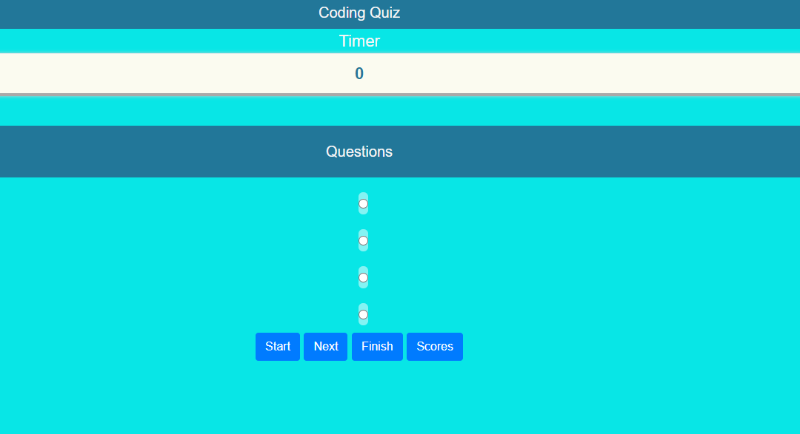
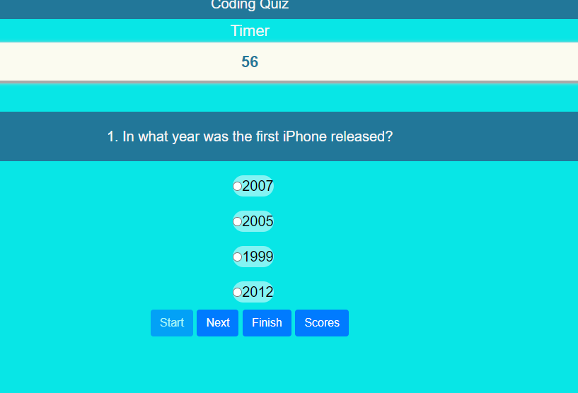

Code Quiz script
================

Overview
--------

This is multiple questions and answers quiz.  

  

You need to select right answer from multiple options of each questions and select right one and press next button to get next question.  

  

The timer will start as you press the start button and will continue until you press Finish button.  After Finish all questions you can see your score by pressing Score button.

  

## Link
 
 https://ikkhan18.github.io/IK-APICQ-111020/

## My notes

I found this assignment challenging. But I learned a lot specially in JavaScript and bootstrap and I am happy with the result.  It can be many changes and improvement on quiz concept but will be doing on latter stage.

Thanks